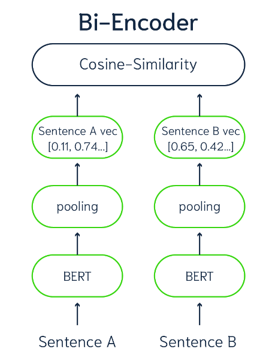

# RAG
The retrieval process consists of three steps: 
* pre-retrieval
* retrieval
* post-retrieval

# retrieval process enhanced with re-ranking
- Utilizing LLMs in similarity scoring algorithms like Cross-Encoder and BERTScore to improve retrieval capabilities
  - particularly as a post-retrieval step in systems like RAG.

# Ranking:
* Bi-Encode
  * scores sentence pairs by generating embeddings in a vector space
  * a language model independently processes each chunk
  * embeddings can be compared using a similarity measure

  
# Re-Ranking    
## Cross-Encoder
  * predicts textual similarity by inputting two chunks into a Transformer network, followed by a classifier to determine similarity probability.
  * Cross-Encoders significantly improve re-ranking accuracy by performing attention mechanisms across queries and documents
    * computationally intensive
    * balancing speed and accuracy
      (mmarco-mMiniLMv2-L12-H384-v1)
  * 

   
## BERTScore 
  * computes similarity scores between reference and candidate sentences using contextual embeddings from a Language Model.
  * sum cosine similarities of token-level embeddings with a token importance weight
    (microsoft/deberta-xlarge-mnli)
    
    
    
## Experiment
* Language models utilized in extracting embeddings

  * The models are DistilBERT from the sentence-transformers library, "msmarco-distilbert-dot-v5," with 66M parameters creating a 768-dimensional vector - 512 tokens per sequence
  * GPT-2 with 774M parameters generating a 1280-dimensional vector - process 1024 tokens
    
* Mean Reciprocal Rank
  * relevant result at rank 1 scores better than at rank k
    $\ MRR = \frac{1}{Q} \sum_{q=1}^{Q} \frac{1}{rank_q} \$
    * Q is the number of queries,
    * q is a specific query,
    * $\ rank_q \$ is the rank (position) of the first relevant result for the query q

|  Language Model            | Rank & Re-ranking | MRR@6     |
| -------------------------- | ----------------- | --------- |
|                            | Bi-Encoder        |0.55       |
| msmacro-distillbert-dot-v5 | Cross-Encoder     |0.83       |
|                            | BERTScore         |0.56       |

|  Language Model            | Rank & Re-ranking | MRR@6     |
| -------------------------- | ----------------- | --------- |
|                            | Bi-Encoder        |0.53       |
|             GPT2           | Cross-Encoder     |0.92       |
|                            | BERTScore         |0.60       |

 parameters: context length

* References 
  *  Retrieve & Re-Rank—Sentence-Transformers documentation. (n.d.). Retrieved July 12, 2023, from https://www.sbert.net/examples/applications/retrieve_rerank/README.html
  *  Zhang, T., Kishore, V., Wu, F., Weinberger, K. Q., & Artzi, Y. (2020). BERTScore: Evaluating Text Generation with BERT (arXiv:1904.09675). arXiv. http://arxiv.org/abs/1904.09675

  

