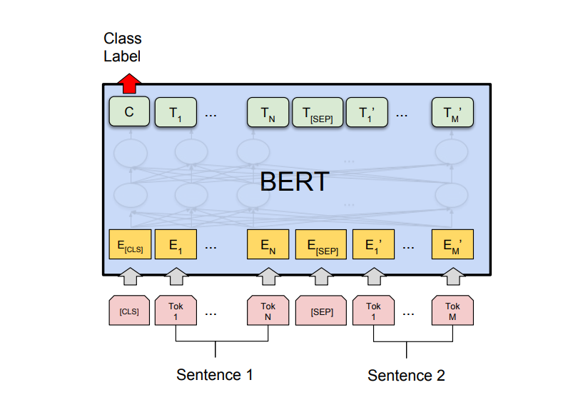
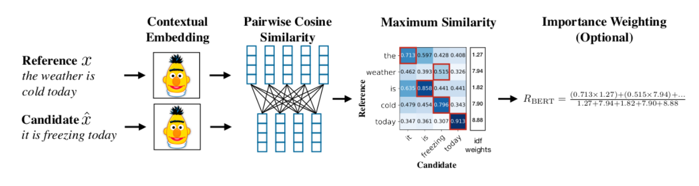

# Retrieval_PostRetrieval
The retrieval process consists of three steps: 
* pre-retrieval
* retrieval
* post-retrieval

# retrieval process enhanced with re-ranking
Utilizing (large) language models in similarity scoring algorithms like Cross-Encoder and BERTScore to improve retrieval capabilities, particularly as a post-retrieval step in systems like RAG.

Ranking and Re-ranking:
* Bi-Encode
  * scores sentence pairs by generating embeddings in a vector space
  * a language model independently processes each chunk (sentence)
  * embeddings can be compared using similarity measures
    
* Cross-Encoder
  * predicts textual similarity by inputting two sentences into a Transformer network, followed by a classifier to determine similarity probability.
  * Cross-Encoders significantly improve re-ranking accuracy by performing attention mechanisms across queries and documents, but are computationally intensive. Therefore, a combination of Bi-Encoder for initial retrieval and Cross-Encoder for re-ranking is effective, balancing speed and accuracy
    (mmarco-mMiniLMv2-L12-H384-v1)
  * 
* BERTScore 
  * computes similarity scores between reference and candidate sentences using contextual embeddings from a Language Model. It is calculated by summing cosine similarities of token-level embeddings extracted by a pre-trained BERT model, with token importance weighted accordingly
    (microsoft/deberta-xlarge-mnli)
    
#Experiment
* Language models utilized in extracting embeddings
* The models are DistilBERT from the sentence-transformers library, "msmarco-distilbert-dot-v5," with 66M parameters creating a 768-dimensional vector, and GPT-2 large from the Transformers library with 774M parameters generating a 1280-dimensional vector. DistilBERT handles 512 tokens per sequence, while GPT-2 large can process 1024 tokens
 # Tables
 ## Mean Reciprocal Rank
 Mean Reciprocal Rank is an order-based metric which means returning the actual relevant results at rank 1 scores better than at rank k. Another attribute of the MMR is that it considers the number of queries in the calculation.
 $\MRR = \frac{1}{Q} sum_{q=1}^Q frac{1}{rank_q}\$
Where Q is the number of queries, q is a specific query, and $\rank_q\$ is the rank (position) of the first actual relevant result for the query q (Briggs & Carnevali, n.d.).
The main advantage of this metric is being order-based which is crucial for systems like question-answering but it just takes into account the first relevant item so, it is not suitable for use-cases that rather to return multiple options like recommendation systems or search engines (Briggs & Carnevali, n.d.).

|  Language Model            | Re-ranking Method | MRR@6     |
| -------------------------- | ----------------- | --------- |
|                            | Bi-Encoder        |0.55       |
| msmacro-distillbert-dot-v5 | Cross-Encoder     |0.83       |
|                            | BERTScore         |0.56       |

 parameters: context length
* References 
  *  Retrieve & Re-Rank—Sentence-Transformers documentation. (n.d.). Retrieved July 12, 2023, from https://www.sbert.net/examples/applications/retrieve_rerank/README.html
  *  Zhang, T., Kishore, V., Wu, F., Weinberger, K. Q., & Artzi, Y. (2020). BERTScore: Evaluating Text Generation with BERT (arXiv:1904.09675). arXiv. http://arxiv.org/abs/1904.09675

  

