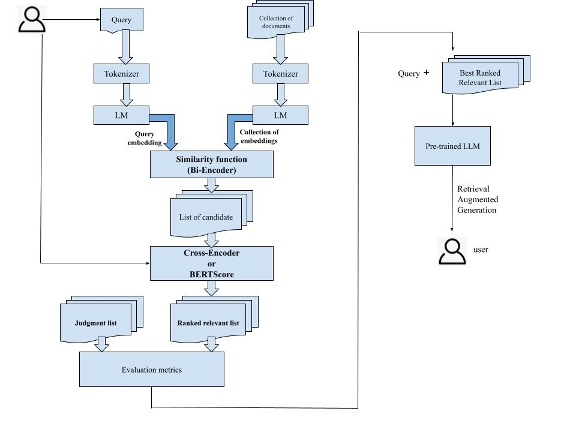

# Retrieval_PostRetrieval_GraphRAG

# retrieval process enhanced with re-ranking
Utilizing (large) language models in similarity scoring algorithms like Cross-Encoder and BERTScore to improve retrieval capabilities, particularly as a post-retrieval step in systems like RAG.

Ranking and Re-ranking:
* Bi-Encode
  * ....
  * ...
  * ...
* Cross-Encoder
  * a
* BERTScore 
  * t
  * x
* xxx 
  *  l 
  *  t
  

